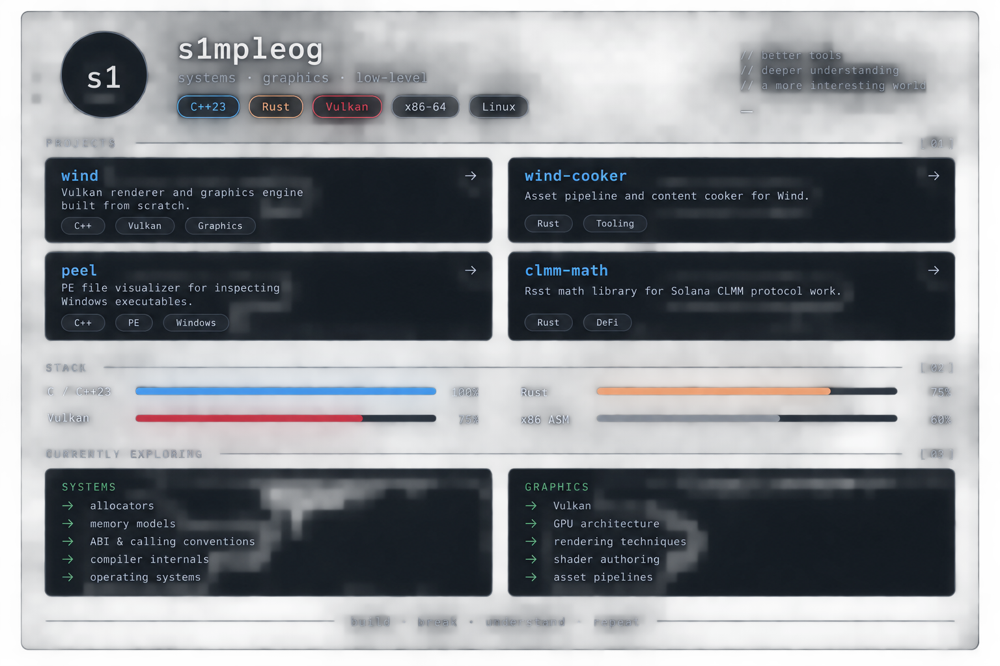

  

  <a href="https://github.com/s1mpleog/wind">wind</a>
  ·
  <a href="https://github.com/s1mpleog/wind-cooker">wind-cooker</a>
  ·
  <a href="https://github.com/s1mpleog/peel">peel</a>
  ·
  <a href="https://github.com/s1mpleog/clmm-math">clmm-math</a>

  <code>C++23</code>
  <code>Rust</code>
  <code>Vulkan</code>
  <code>x86-64</code>
  <code>Linux</code>

---

### projects

#### [wind](https://github.com/s1mpleog/wind)

Vulkan renderer and graphics engine built from scratch.

`C++` · `Vulkan` · `Graphics`

#### [wind-cooker](https://github.com/s1mpleog/wind-cooker)

Asset pipeline and content cooker for Wind.

`Rust` · `Tooling`

#### [peel](https://github.com/s1mpleog/peel)

PE file visualizer for inspecting Windows executables.

`C++` · `PE` · `Windows`

#### [clmm-math](https://github.com/s1mpleog/clmm-math)

Rust math library for Solana CLMM protocol work.

`Rust` · `DeFi`

---

### currently exploring

**systems**

* allocators
* memory models
* ABI & calling conventions
* compiler internals
* operating systems

**graphics**

* Vulkan
* GPU architecture
* rendering techniques
* shader authoring
* asset pipelines

---

  <code>build · break · understand · repeat</code>

