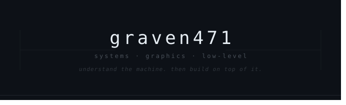

<div align="center">



<br/>

`C++23` &nbsp;·&nbsp; `Rust` &nbsp;·&nbsp; `x86-64 ASM` &nbsp;·&nbsp; `Vulkan` &nbsp;·&nbsp; `Linux`

</div>

---

### SELECTED REPOSITORIES

<details open>
<summary><a href="https://github.com/graven471/wind"><b><code>wind</code></b></a> — Vulkan Real-Time Renderer & Graphics Engine Core &nbsp;<code>C++23</code> <code>Vulkan</code> <code>SPIR-V</code></summary>
<br>

* **Architecture:** Modular 3D rendering core engineered from scratch without third-party frameworks.
* **Synchronization:** Explicit timeline semaphores, automated layout transitions, and fine-grained barrier graphs.
* **Memory & Execution:** Stateless command buffer recording with custom GPU buffer and image sub-allocators.
* **Status:** Active development · Targeting Linux & Vulkan 1.3+

</details>

<details open>
<summary><a href="https://github.com/graven471/peel"><b><code>peel</code></b></a> — x86-64 Machine-Code Disassembler & PE Inspector &nbsp;<code>C++23</code> <code>x86-64</code> <code>Win32</code></summary>
<br>

* **Binary Analysis:** Standalone zero-dependency visualizer and instruction-stream decoder.
* **Manual Compliance:** Decodes prefixes, opcodes, ModR/M, and SIB addressing directly from raw bytes using Intel specifications.
* **Format Inspection:** Complete structural traversal of Portable Executable (PE32+) headers, section mappings, and import tables.
* **Status:** Complete · Standalone CLI & visualizer

</details>

<details open>
<summary><a href="https://github.com/graven471/clmm-math"><b><code>clmm-math</code></b></a> — Deterministic Fixed-Point Math Engine &nbsp;<code>Rust</code> <code>Solana</code> <code>Fixed-Point</code></summary>
<br>

* **Numerical Precision:** High-precision mathematical primitives tailored for concentrated liquidity AMM protocols.
* **Arithmetic:** Deterministic Q64.64 fixed-point operations with guaranteed zero-overflow arithmetic under strict compute limits.
* **Tick Math:** Constant-time tick-to-sqrt-price algorithms and exact token delta calculations.
* **Status:** Production-ready primitives · Devnet tested

</details>

<details open>
<summary><a href="https://github.com/graven471/wind-cooker"><b><code>wind-cooker</code></b></a> — Offline Asset Pipeline & Binary Compiler &nbsp;<code>Rust</code> <code>Tooling</code> <code>SPIR-V</code></summary>
<br>

* **Shader Processing:** Direct compilation, validation, and reflection of GLSL/HLSL stages into optimized SPIR-V binaries.
* **Data Packing:** Conditions raw geometry and textures into memory-mappable, zero-copy runtime file formats.
* **Integration:** Dedicated asset conditioning toolchain companion for `wind`.
* **Status:** Active tooling

</details>

---

### TECHNICAL SCOPE & PRIMITIVES

<details open>
<summary><b>Systems & Runtime Internals</b></summary>
<br>

* **Memory Models:** Custom slab, arena, and pool allocators with explicit cache-line alignment and padding.
* **Binary Formats:** Parsing and traversal of PE32+ and ELF executables, symbol tables, and relocation entries.
* **Low-Level Runtime:** x86-64 calling conventions, ABI boundaries, and hardware register constraints.
* **Acceleration:** SIMD vectorization (AVX2 / SSE4.2) for compute-heavy routines.

</details>

<details>
<summary><b>Graphics & Hardware Pipelines</b></summary>
<br>

* **Vulkan Primitives:** Explicit synchronization, timeline semaphores, fine-grained barriers, and dedicated staging buffers.
* **Shader Pipelines:** Multi-stage compilation to SPIR-V, descriptor reflection, and specialization constants.
* **Engine Core:** Data-oriented scene architectures and stateless command buffer recording patterns.

</details>

<details>
<summary><b>Protocol Mechanics & Numerical Schemes</b></summary>
<br>

* **Fixed-Point Arithmetic:** Exact integer math, discrete tick indexing, and invariant bonding curve formulas.
* **State Machines:** Zero-copy serialization, high-throughput on-chain safety, and state verification under compute budgets.

</details>

---

### WORKSPACE & TOOLCHAINS

```text
host        :: linux (arch / gentoo)
toolchains  :: clang++ / gcc · rustc / cargo · nasm · vulkan-sdk
environment :: neovim · git · tmux
debuggers   :: renderdoc · gdb · valgrind
```

---

<p align="center">
  <code>build</code> &nbsp;·&nbsp; <code>break</code> &nbsp;·&nbsp; <code>inspect</code> &nbsp;·&nbsp; <code>understand</code> &nbsp;·&nbsp; <code>repeat</code>
</p>
